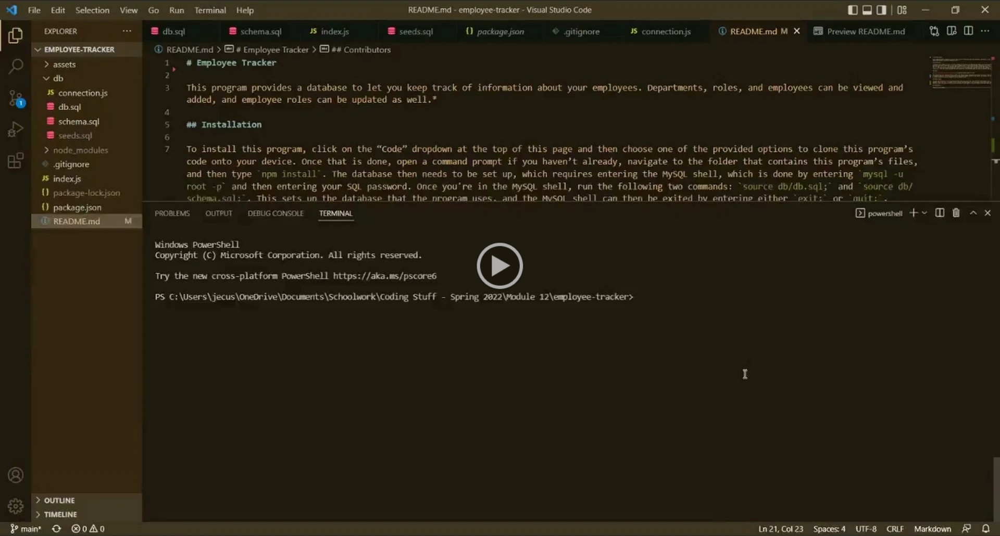

*This documentation is a work in progress.*

# Employee Tracker

This program provides a database to let you keep track of information about your employees. Departments, roles, and employees can be viewed and added, and employee roles can be updated as well.*

## Installation

To install this program, click on the “Code” dropdown at the top of this page and then choose one of the provided options to clone this program’s code onto your device. Once that is done, open a command prompt if you haven’t already, navigate to the folder that contains this program’s files, and then type `npm install`. The database then needs to be set up, which requires entering the MySQL shell, which is done by entering `mysql -u root -p` and then entering your SQL password. Once you're in the MySQL shell, run the following two commands: `source db/db.sql;` and `source db/schema.sql;`. This sets up the database that the program uses, and the MySQL shell can then be exited by entering either `exit;` or `quit;`.

## Usage

Once everything in the previous section is done, this program can be initiated by entering `node index`. This program will then give you an array of options to perform, including viewing the provided table, adding records to the tables, and .

## *Known Issues

## Contributors

Made with 💔 by JEC6789